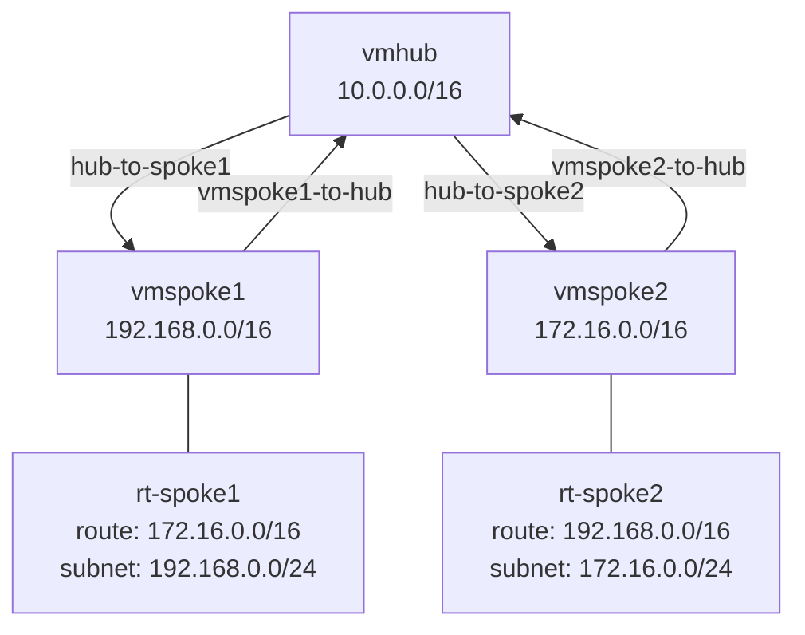

# Azure Rede Hub-Spoke
Implementação de um ambiente de rede de gerenciamento utilizando o modelo **hub-spoke** no **Microsoft Azure**.

> [!NOTE]
> **Hub-Spoke** é uma topologia centralizada em que uma única rede central (hub) se conecta a várias redes periféricas (spokes), onde o hub atua como ponto focal para o tráfego de inter-rede, firewalls e serviços compartilhados.

## Topologia


## Recursos Criados
| Recurso | Nome | Endereço |
|---|---|---|
| VNET Hub | vmhub | 10.0.0.0/16 |
| VNET Spoke1 | vmspoke1 | 192.168.0.0/16 |
| VNET Spoke2 | vmspoke2 | 172.16.0.0/16 |
| VM Hub | vmhub | 10.0.0.4 |
| VM Spoke1 | vmspoke1 | 192.168.0.4 |
| VM Spoke2 | vmspoke2 | 172.16.0.4 |

---

## Etapas
### 1. Criação das VNETs
Criação das três redes virtuais no **resource-group** `rg-hubspoke`.


### 2. Peerigns
Configuração do **peering** entre **Hub ↔ Spoke1 e Hub ↔ Spoke2**, com status _Fully Synchronized / Connected_.


### 3. Virtual Machines
Criação de três VMs Linux, uma em cada VNET.


### 4. Route Tables
Criação das **routes tables** `rt-spoke1` e `rt-spoke2`, associados às subnets de cada Spoke.


**Spoke 1: Rotas e Subnet**
Rota para `spoke2` (172.16.0.0/16) via **VirtualAppliance** – 10.0.0.4 (Hub).
Subnet `default` (192.168.0.0/24) associado à VNET `vmspoke1`.


**Spoke 2: Rotas e Subnet**
Rota para `spoke1` (192.168.0.0/16) via **VirtualAppliance** – 10.0.0.4 (Hub).
Subnet `default` (172.16.0.0/24) associado à VNET `vmspoke2`.


### 5. Habilitação IP Forwarding
Ativação do **ip forwarding na interface de rede da VM Hub** (`vmhub118`), permitindo que ela **encaminhe pacotes entre os spokes**.


### 6. Configuração VM Hub
Comandos executados na VM Hub para **habilitar o roteamento no nível do sistema operacional Linux**.
```bash
sudo sysctl -w net.ipv4.ip_forward=1
echo "net.ipv4.ip_forward=1" | sudo tee -a /etc/sysctl.conf
sudo iptables -A FORWARD -j ACCEPT
sudo iptables -t nat -A POSTROUTING -j MASQUERADE
sudo apt update && sudo apt install iptables-persistent -y
```


### 7. Resultados
**Roteamento Ativo: Ping entre VMs**
Validação da comunicação entre Spoke2 ↔ Spoke 1 e Hub para Spoke1/Spoke2, confirmando **roteamento via hub**.


**Effective Routes: VM Hub**
Rotas efetivas da interface de rede do Hub, mostrando as redes dos Spokes aprendidas via VNET Peering.


### Conclusão
- [x] Arquitetura Hub-Spoke implementada
- [x] Hub atua como ponto central de roteamento
- [x] Permite comunicação entre os spokes sem peering direto entre eles
- [x] Gerenciamento e escalabilidade de rede facilitada
